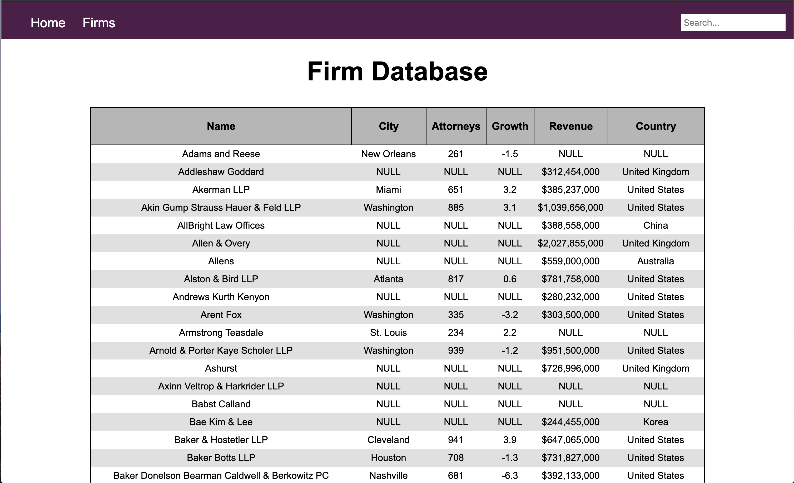
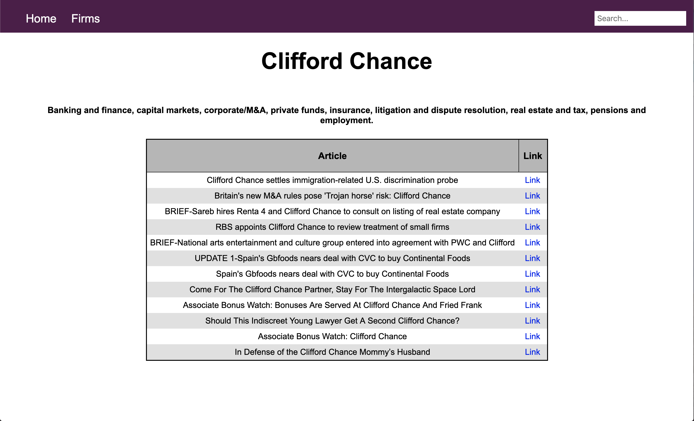

Task: To collect data from the top 200 law firms in the United States (later expanded to over 400).

# DataProject 

## Scrapers 1 and 2
These are the files that contain the webscrapers. HTTP requests are handled via urllib.requests while the actual scraping is done with the very capable BeautifulSoup4 package. Each website's scraper is written as its own class making accessing site-specific data quite simple. All one needs to do is create an instance of the class and call the scrape method -- this will return all relevant information in the form of a dictionary.

For example:

  ```python
    s = IRLG_Scraper()
    data = s.scrape()
  ```

Furthermore, all the scraped data is stored in a JSON file. This is largely a legacy feature (I wrote the scrapers before writing the SQL database) as I didn't want to rescrape the data each time. 

The dictionary keys that are used when storing the data from each scraper would become the names of the columns in certain SQL tables which is why I was careful not to make sure they were largely the same. 

Sites scraped:
  1. IRLG: America's Largest 350 Firms -- data\
          https://www.ilrg.com/nlj250?
  2. Wikipedia: List of largest law firms by revenue -- data\
         https://en.wikipedia.org/wiki/List_of_largest_law_firms_by_revenue
  3. Chambers Associate (CA): A to Z Firm List -- mainareas\
        http://www.chambers-associate.com/law-firms/a-to-z-firm-list
  4. Altman Weil: MergerLine -- acquired\
      http://www.altmanweil.com/index.cfm/fa/m.home/bl/1/dtYear/2019/altman-weil-merger-line-for-2019.cfm
  5. Reuters News -- news\
      https://www.reuters.com/
  6. AbovetheLaw -- news\
      https://abovethelaw.com/

## InputData

This is the meatiest of the subroutines I wrote as well as the one of which I am most proud. The class InputData interfaces Python and MySQL using the mysql.connector package. This helpful packages provides database connection, query-execution, and database commits all through Python scripts. 

The database itself is lazily constructed or, as I prefer to put it, "self-expanding." This means that, when constructing the database, I only fully hard-coded a single table 'names' to store unique primary keys (ID) linked to the names of each of the law firms. Each subsequent table needs only a manually created ID column so when writing a new scraper and inputting it into the database, the database will automatically add relevant new columns. 

For each dictionary entry passed by the scraper (i.e. the data scraped about a specific firm) the InputData class automatically queries the database to see if the firm already exists. If it does, it retrieves the primary key and links the data in the new table to the right place in the 'names' table. If the name does not already exist, it adds the new firm to the 'names' table and then does the same thing as if the name existed.

To input data into the database we simply need to specify the name of the table we want to store data in as well as pass a dictionary that contains data from a scraper. Input data also takes an optional parameter, "allow_multiple" which allows multiple entries with the same ID number (used in the "news" table).

So scraping combined with inputting it into the database (specifically in table "test") looks like:

```python
from dataproject/scraper1 import IRLG_Scraper
from dataproject/inputdata import InputData

s = IRLG_Scraper()
data = s.scrape()

i = InputData("test" [, allow_multiple=False/True])
i.push(data)
i.close()
```

Furthermore, I also wrote a fuzzy_name_matching function that returns whether or not a name closely resembles one that's already in the database. Additionally, I wrote a check_overlap function that returns how many rich entries are in the database, that is, the percentage of law firms have data collected from every website I have scraped.

One also needs to make sure to change the database connection details in driver.py.

# Django-Server

To display my work (as most of it was backend up until this point) I decided to pursue making a website from scratch with the Django framework. Most of the files and directories here are standard Django url routing and other fairly basic although at time convoluted processes. 

Additionally, I wrote several HTML templates and a single CSS stylesheet to add some minor style to the website. As of right now the website is static although I have implemented a search feature which either takes the name of a firm or a location (i.e. city or country). 

To run the server, one has to first install the Django module as well as the MySQL connector pymysql:

```
pip install Django
pip install pymysql
```

Then all one has to do is navigate to the django_server directory and type into the command line:
```
python3 manage.py runserver
```


I have included some photos for posterity:







